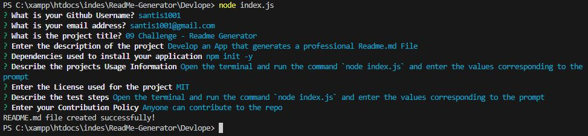
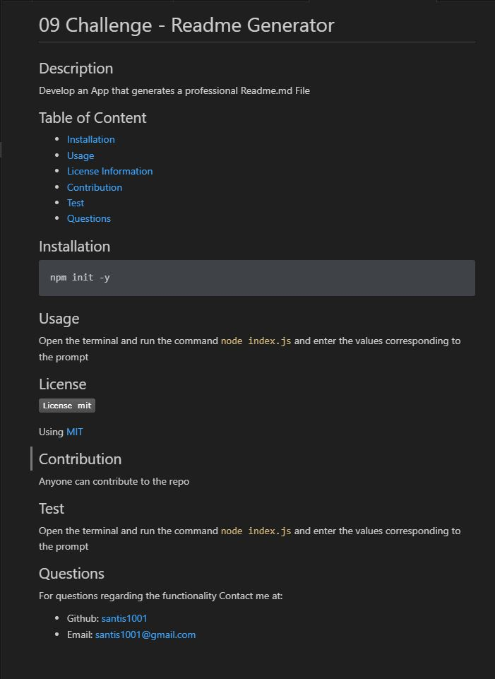
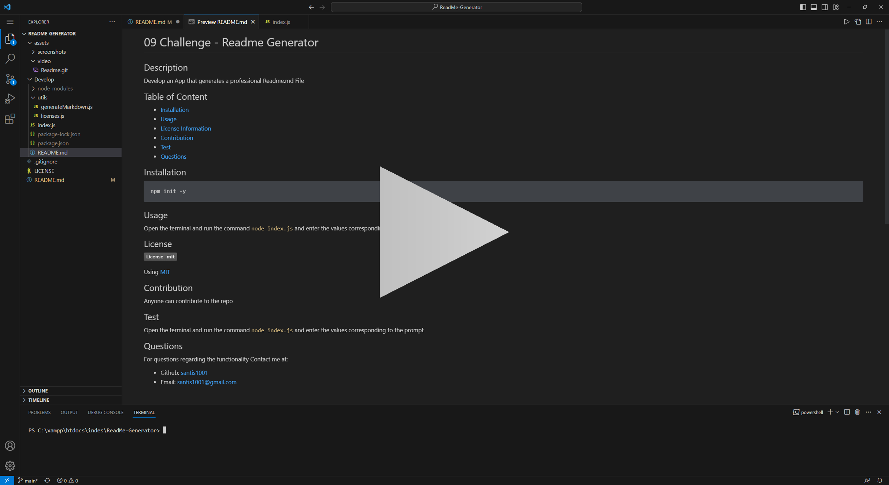

# ReadMe-Generator
09 Challenge
## Description
This application can quickly create and structure a professional README.md file from command-line prompts and inputting characteristics from your project. 
The project requires `inquirer` and `node`.

## User Story
```
AS A developer
I WANT a README generator
SO THAT I can quickly create a professional README for a new project
```
## Acceptance Criteria
```
GIVEN a command-line application that accepts user input
WHEN I am prompted for information about my application repository
THEN a high-quality, professional README.md is generated with the title of my project and sections entitled Description, Table of Contents, Installation, Usage, License, Contributing, Tests, and Questions
WHEN I enter my project title
THEN this is displayed as the title of the README
WHEN I enter a description, installation instructions, usage information, contribution guidelines, and test instructions
THEN this information is added to the sections of the README entitled Description, Installation, Usage, Contributing, and Tests
WHEN I choose a license for my application from a list of options
THEN a badge for that license is added near the top of the README and a notice is added to the section of the README entitled License that explains which license the application is covered under
WHEN I enter my GitHub username
THEN this is added to the section of the README entitled Questions, with a link to my GitHub profile
WHEN I enter my email address
THEN this is added to the section of the README entitled Questions, with instructions on how to reach me with additional questions
WHEN I click on the links in the Table of Contents
THEN I am taken to the corresponding section of the README
```
## Code Snippets
### Overall functionality
The main function uses the inquirer package to prompt the user with a series of questions defined in the questions object array. The inquirer.prompt() method returns a promise that resolves with the user's answers. Which then the answers are sent as parameters to `generateMarkdown()` function.
```js
function init() {
    return inquirer.prompt(questions).then((answers) => {
        const readme = generateMarkdown(answers);
        writeToFile('./README.md',readme);
    });
}
init();
```
`generateMarkdown()` Function
In this function method the answers are recieved and formated to create the ReadMe.md structure.
```js
function generateMarkdown(data) {
  const licenseNameToFind = "Apache license 2.0";
  const index = lcs.findIndex(item => item.license === data.License);
  const licenseSelected = lcs[index];
  return `# ${data.Title}
## Description
${data.Description}

## Table of Content
- [Installation](#installation)
- [Usage](#usage)
- [License Information](#License)
- [Contribution](#contribution)
- [Test](#test)
- [Questions](#questions)
## Installation
\`\`\`
${data.Installation}
\`\`\`

## Usage
${data.Usage}
## License
${renderLicenseSection(licenseSelected)}

${AddContribution(data.Contributing)}

## Test
${data.Test}

## Questions
For questions regarding the functionality
Contact me at: 
* Github: [${data.username}](https://github.com/${data.username})
* Email: ${data.Email}

`;
}
```
## Screenshots


## Generated Readme.md File
[Readme Generation file](./Develop/README.md)

## Video
[](https://1drv.ms/v/s!Asj9JhD05ulbsmRHheetWfNhK4YW?e=TIEhTD)
